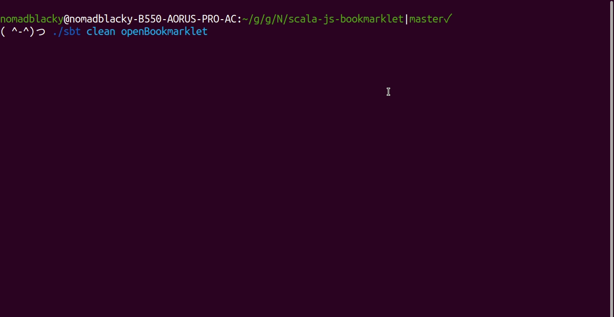

# scala-js-bookmarklet

Implemented a bookmarklet with Scala.js.

## How to use

Run `./sbt openBookmarklet` to open an HTML file in your browser.  
Then click an anchor to test the bookmarklet.  
When it's complete, drag and drop the anchor to the bookmark bar to save it.

